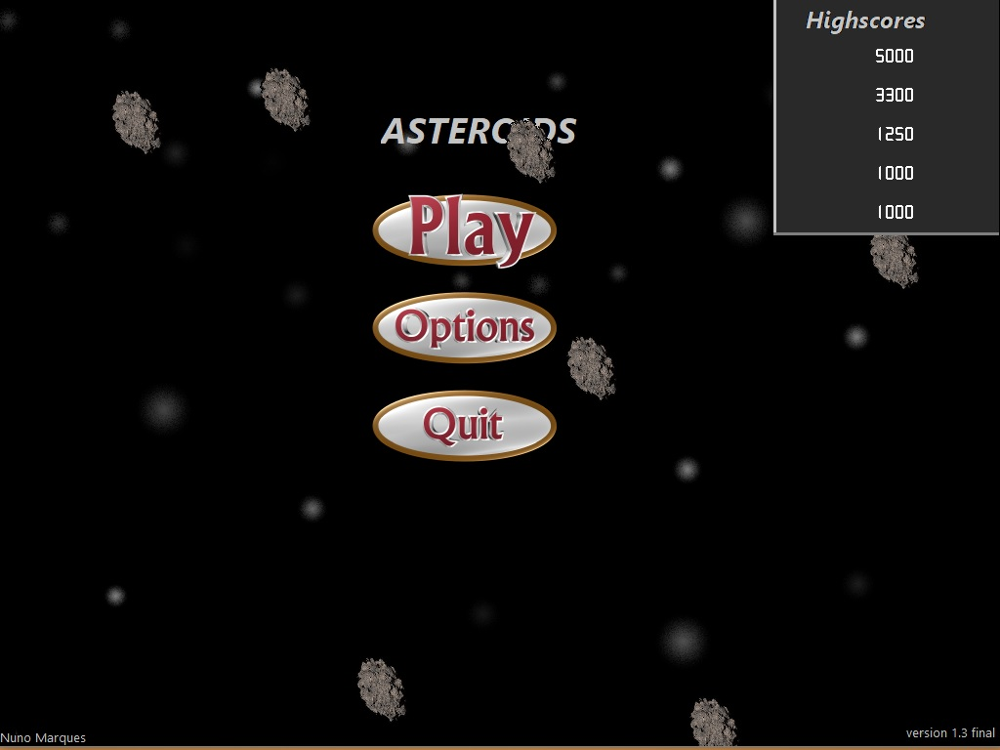
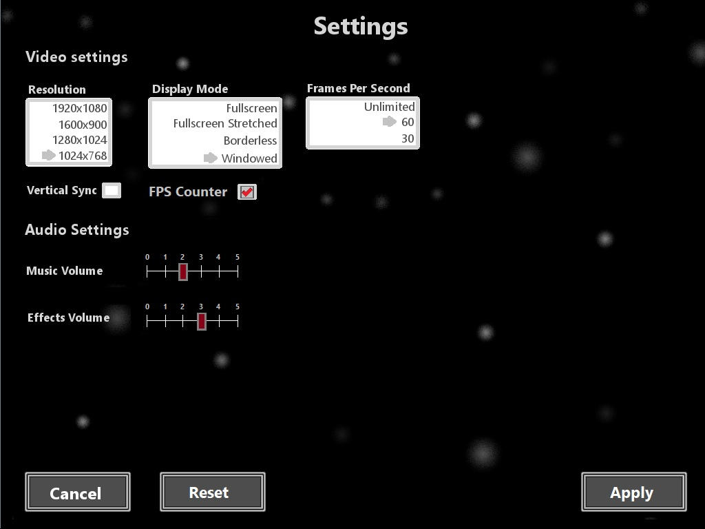

# Asteroids_SDL_Port
Port/continuation of LCOM's project "Asteroids" for minix, based on the original 1979 game. This game uses SDL 2.0.

## Instructions:
* config.txt contains the game settings in the options menu.
* To compile you need SDL 2.0 and SDL mixer installed. The ctpl library is also needed or you can alter the lines that make use of multithreading.

## Game Demo:

Game demo

Original Minix Project demo

