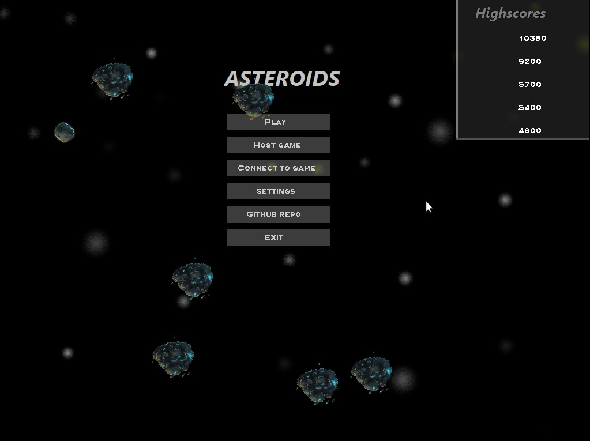
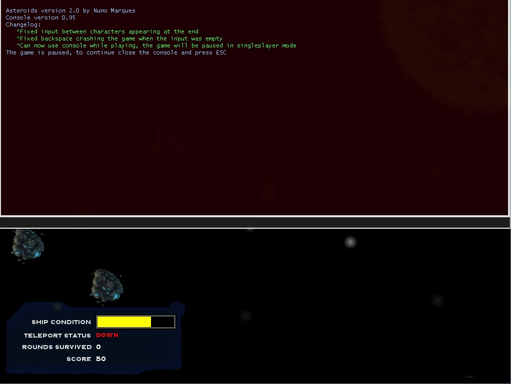
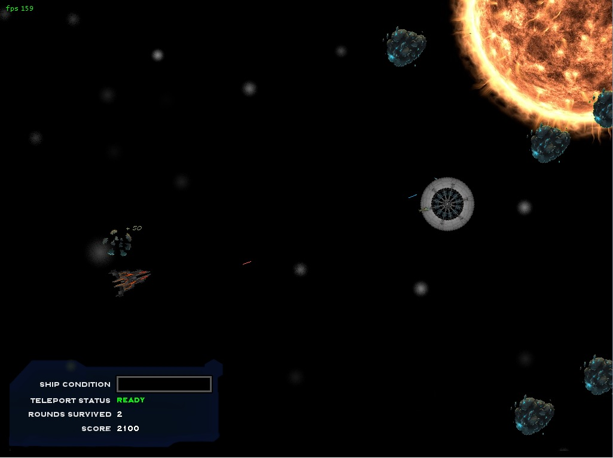
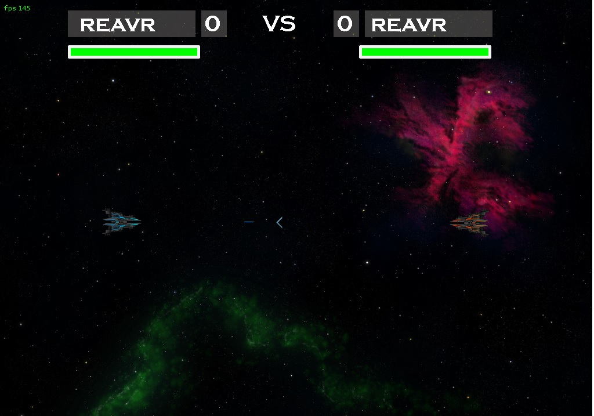

# Asteroids_SDL_Port
Port/continuation of LCOM's project "Asteroids" for minix, based on the original 1979 game. This game uses SDL 2.0.

## Instructions:
* settings.cfg contains the game settings in the options menu.
* To compile you need SDL 2.0 aswell as SDL mixer, SDL_ttf and SDL_net libraries installed. The ctpl library is also needed or you can alter the lines that make use of multithreading.
* You can use the command help on the console to get a list of all available commands.
* This game uses various free to use assets, the multiplayer mode of the game has various bugs and is mostly unfinished.
* This project was done mostly for fun and learning, don't expect a polished game.

## Game Demo:

Game demo

